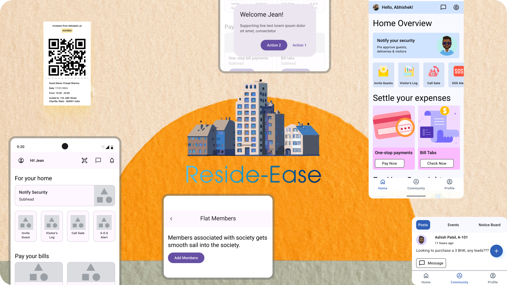

 

Reside-Ease is a Flutter application designed to help residents of a society manage their day-to-day activities and keep track of their dues seamlessly. This app allows users to create accounts, add family members, manage additional properties, and access a community section for resident communication.

## Features

- **Account Management**: Easily create and manage personal accounts.
- **Family Members**: Add and manage family members under your account.
- **Property Management**: Handle multiple properties efficiently.
- **Community Section**: Engage with other residents through the community section.
- **Agile Development**: Developed using Agile methodology for iterative development, frequent releases, and continuous user feedback integration.
- **Enhanced Usability**: Leveraged user feedback and analytics in sprints to refine usability, resulting in a 20% increase in user engagement and a more intuitive navigation experience.
